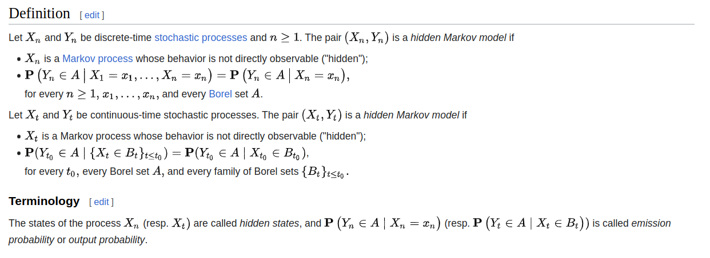

= LLaMaO
NLP, RNNs, Transformers, LLMs and stuff... by Jaden Furtado
:doctype: book
:preface-title: Preface
// Settings:
:source-highlighter: rouge
:experimental:
:reproducible:
:icons: font
:listing-caption: Listing
:sectnums:
:toc:
:toclevels: 3
:xrefstyle: short
ifdef::backend-pdf[]
:pdf-theme: index
:pdf-themesdir: {docdir}
:source-highlighter: rouge
//:rouge-style: github
endif::[]
:url: https://github.com/JadenFurtado/LLaMaO/tree/main/

== Introduction

I've found that most gloss over text generation and take this stuff at face level without understanding the beauty which lies beneath. The purpose of this is to give you an intuition of what is going on behind the scenes.

____
Start by doing what's necessary; then do what's possible; and suddenly you are doing the impossible. 
- Francis of Assisi
____


I'll be following the approach of this quote :)


image::https://i.pinimg.com/originals/aa/e1/c8/aae1c8a32d6bfa5aa3db567fc14f8451.jpg[]


The analogies aren't the best, but then again I haven't promised mathematical rigour!

*P.S: I love maths, so don't judge me!*


== But how do computers work :_)

I'm sure you're asking yourself, why do I need this information for understanding LLMs, but I assure you, this will come back later on and is crucial for gaining an intuition :)

In it's purest form, I would argue that computers store information in the form of binary digits, i.e. as 1s and 0s. They have a processor accepts this(maybe whole or in chunks) information in the form of inputs, does some mathematical stuff, one instruction provided by the user at a time, say foo() on them and spits out an output that is also in the form of 1s and 0s that can be interpreted to arrive at some useful conclusion.

image::https://cdn4.explainthatstuff.com/how-computer-works.png[]

== What is the purpose of ML?

I know it's another silly question at face value, but I promise you, it it super important for gaining an intuition behind LLMs :)

=== Giving it a go

Say I gave you, the reader a task. The task goes something as follows:


I have bunch of inputs, say ```Inp```. 
I have a bunch of expected outputs, say ```Out```. I know when I pass the inputs through a function ```foo()```, it gives me the expected output ```Out```. Can you figure out a way to replicate this function ```foo()``` using a computer if ```foo()``` was a blackbox(no way of knowing what was going on inside) function?

```
inp = data
output = foo(inp)
```

If I were to put this in code as shown above, we could say that given the input and output, figure out how to replicate foo

Say we have another function ```boo()```. It accepts three inputs. They are ```inputs```, ```weights``` and ```biases``` respectively.

We could now reword the problem statement to something like

Given a bunch of inputs, expected outputs, weights and biases, adjust the weights and biases in ```boo()```, such that you minimize ```|output-output'|```. We effectively want to tune these two inputs so that we can adjust the output of our mock function boo() 

```
inputs = data
output'= boo(inputs,weights,biases)
output = foo(inputs)
```

In an ideal world, we want to ensure that ```difference(output,output')``` is equal to 0.

If you've read through all of that, well good for you, because

=== This act of adjusting the weights and biases is called Machine learning :)

Now there are many ways to achieve this, i.e. the adjustment of weights and biases and it depends on what you want to do. 


== NLP

[1] Natural language processing (NLP) is an interdisciplinary subfield of computer science and linguistics. It is primarily concerned with giving computers the ability to support and manipulate speech. It involves processing natural language datasets, such as text corpora or speech corpora, using either rule-based or probabilistic (i.e. statistical and, most recently, neural network-based) machine learning approaches. The goal is a computer capable of "understanding" the contents of documents, including the contextual nuances of the language within them. The technology can then accurately extract information and insights contained in the documents as well as categorize and organize the documents themselves.

Challenges in natural language processing frequently involve speech recognition, natural-language understanding, and natural-language generation. 

image::https://cdn.ttgtmedia.com/rms/onlineimages/how_nlp_nlu_nlg_are_related-f.png[]

*We'll be focusing on Natural Language generation(NLG)*

=== How does NLG work?
NLG is a multi-stage process, with each step further refining the data being used to produce content with natural-sounding language. The six stages of NLG are as follows:

*Content analysis.* 
Data is filtered to determine what should be included in the content produced at the end of the process. This stage includes identifying the main topics in the source document and the relationships between them.

*Data understanding.* 
The data is interpreted, patterns are identified and it's put into context. Machine learning is often used at this stage.

*Document structuring.* 
A document plan is created and a narrative structure chosen based on the type of data being interpreted.

*Sentence aggregation.* 
Relevant sentences or parts of sentences are combined in ways that accurately summarize the topic.

*Grammatical structuring.* 
Grammatical rules are applied to generate natural-sounding text. The program deduces the syntactical structure of the sentence. It then uses this information to rewrite the sentence in a grammatically correct manner.

*Language presentation.* 
The final output is generated based on a template or format the user or programmer has selected.

== In our case, we are looking at generative AI. Specifically, given some input text, we want a response, also in text which is human readable. 

Throwback to what we did in the previous section, i.e. adjust weights and biases of boo() such that it approximates foo()

In our case, since we are looking at generative AI with NLP. 
Specifically, we have an imginary function foo(), which given some input text, gives us a *relevant* response, also in text which is human readable. Find a function ```boo()``` that will approximate this!

Remember how I said that there are many ways of going about finding the weights and biases such that output-output' is as small as possible? Yeah, from this point onwards, each chapter is one such method. They get progressively better at this. In other words, output-output' keeps getting smaller :)

== Hidden Markovian Models

Let's take a step back and think about the problem. 

=== What are we trying to do? 
We are trying to generate coherent sentences that are relevant to us. 

=== What's the silliest thing that would work?

Well, if we have a sample text of what we expect from our function ```boo()```, which we do, we could just look at which words occur together and assign them a weight based on how likely two words are to occur next to each other.

This is called a co-occurence matrix :)

image::https://x-wei.github.io/images/xcs224n-lecture2/pasted_image012.png[]

We can now use this information to generate sentences. 

include::Markovian/README.adoc[lines=4..33]

Mathematically, this idea can be represented using Markov models.

In this, we'll specifically be dealing with Hidden Markov models. 

=== What are Markovian Models

image::https://i.ytimg.com/vi/9yl4XGp5OEg/maxresdefault.jpg[]


=== Want the maths behind this stuff?

For the math geeks, here is the maths :)



=== Example Text generation models using HMMs

I've added two text generation models that use HMMs. You can find them

link:{url}Markovian/HMM-based-Text-Prediction-Generation/[HMM based text Prediction Generation] and link:{url}Markovian/README.adoc[Markovian models]

Okay, that's a good start, sort off...

In this case, we have a few issues

* The generated text is as good as the input corpus (garbage in garbage out)

More importantly,

* We find the need to create multiple n-gram Markov Chains (high order model) to captue the context.

Going back to what we discussed in the, we find a problem. This is going to cost us a ton of resources computationally :P 

Sure, it may get better eventually, and we could optimize our work by doing stuff in parallel and foo, but, what's the use of the model if it takes 20000 years to get decent at generation of coherent sentences? 

Can we do better than this? 
Yes, bring on RNNs

== RNNs

Well before there were RNNs, we had simple Feed Forward Neural networks :) 

=== What the heck is a Feed Forward Neural Network?
While these don't add much value to our discussion about solving the text generation problem, they are important for understanding RNNs! 

* A feed forward neural network consists, surprise-surprise, neurons!

image::https://media.geeksforgeeks.org/wp-content/uploads/20211006141212/BPN.png[]

==== What is a neuron you ask?

image::https://www.researchgate.net/publication/337552334/figure/fig1/AS:829657444265986@1574817157632/The-structure-of-the-feedforward-neural-network-approach-algorithm-is-shown-Basically.ppm[]

Well, throw back to out function ```boo()```. Remember how I said it accepts weights and biases? 
Yeah, well, when you supply a bunch of weights and biases, in the form of a matrix, you effectively have yourselves a Neural Network of sorts :)

Right now, we aren't concerned with the exact structure of our Neural network. What we are concerned with is generating coherent text!

The reason I said that FFNs aren't great for our task is cause they are a one time thing. 
*The output of our network only depends upton the input you feed into it at the time of execution and does not depend upon past inputs.*
This causes a ton of problems when we are trying to model something the is sequential, such as language!
As we have previously discussed, the past word is important for us to predict the next word. How do we get around this in an FFN? Well we add a recurrent element to the Network. Let's call this element ```history``` 


Remember how I said ```boo()``` was effectively a neural network? Let's modify it

We add the historic term ```hist``` so that boo now accepts ```boo(inputs, weights, biases, hist)``` 

What's the purpose of hist? To track/model the current state of the RNN. Yes, we now have ourselves a fancy(and very powerful) state machine :)

=== But what are RNNs again?

Well, they're the big brother of Markovian Models :) Sort off! I'd argue that an RNN is a more specific version of a Markov Model; A Markov Model with a fancy hat on????

It is difficult for me to explain what I mean by this without additional information. Heck, this is not a book, it's just a repository!

image::https://www.tensorflow.org/static/text/tutorials/images/text_generation_training.png[]

link:{url}RNN/README.adoc[I've added a detailed walk through of RNNs for your reference here]


==== Run a Vanilla RNN

I've added the code for a vanilla RNN link:{url}RNN/RNN.py[here]

```python
include::RNN/RNN.py[]
```

=== What do you think is the main drawback of RNNs? 
Did you catch it? While RNNs (and LSTMs) are comparatively better than Marcov models, they still lack the ability to map long term dependencies. What do I mean by that? Frankly, IDK!  

 :P


== Transformers

image::https://machinelearningmastery.com/wp-content/uploads/2021/08/attention_research_1.png[]


== References

[1] https://en.wikipedia.org/wiki/Neuro-linguistic_programming

[2] https://www.techtarget.com/searchenterpriseai/definition/natural-language-generation-NLG

[3] https://github.com/Usajid/HMM-based-Text-Prediction-Generation/

[4] https://medium.com/@annikabrundyn1/the-beginners-guide-to-recurrent-neural-networks-and-text-generation-44a70c34067f

[5] https://www.tensorflow.org/text/tutorials/text_generation

[6] https://gist.github.com/karpathy/d4dee566867f8291f086

[7] https://towardsdatascience.com/all-you-need-to-know-about-attention-and-transformers-in-depth-understanding-part-1-552f0b41d021

[8] https://www.lesswrong.com/posts/pHPmMGEMYefk9jLeh/llm-basics-embedding-spaces-transformer-token-vectors-are